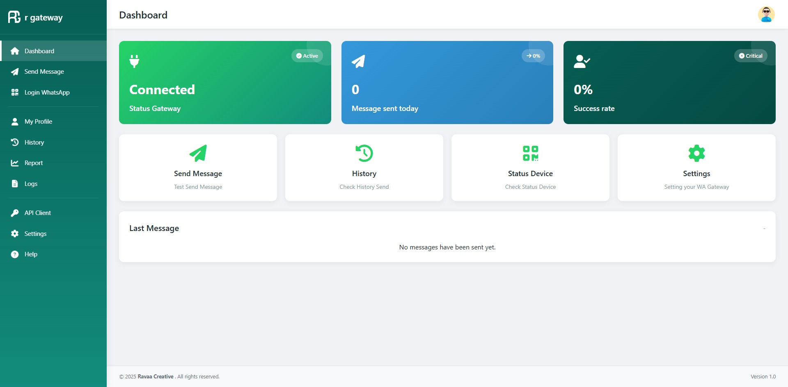

# 📡 R Gateway – WhatsApp API Gateway

**R Gateway** adalah sistem penghubung (gateway) untuk mengirim pesan WhatsApp secara otomatis melalui REST API. Sistem ini cocok untuk integrasi dengan aplikasi pihak ketiga seperti sistem billing, notifikasi transaksi, chatbot, dll.

---

## 🚀 Fitur

- ✅ Kirim pesan WhatsApp via API
- ✅ Token API per client
- ✅ Dukungan multi-user / multi-session
- ✅ Dashboard pengelolaan pengguna dan status koneksi
- ✅ Riwayat pengiriman & laporan

## 🖼️ Tampilan Dashboard

Berikut contoh tampilan dashboard dari aplikasi **R Gateway**:

---

## 🔧 Instalasi

### 1. Clone & Install
```bash
git clone https://github.com/kholif18/r-gateway.git
cd r-gateway
composer install
cp .env.example .env
php artisan key:generate
```

### 2. Konfigurasi `.env`
Edit dan tambahkan kode berikut di paling bawah pada file `.env`:

```env
WA_BACKEND_URL=http://wa_backend:3000
API_SECRET=your_api_secret_key
```

### 3. Jalankan migrasi & seeder
```bash
php artisan migrate --seed
```

### 4. Jalankan server Laravel
```bash
php artisan serve
```

Pastikan backend WhatsApp (`wa-backend`) juga berjalan di port yang sesuai.
Jika wa-backend berjalan di host, isikan alamat ip wa-beckend tersebut
Contoh:
http://wa_backend:3000 -> misal di docker
http://localhost:3000 -> host
http://127.0.0.1:3000

---

## 🧪 API Pengiriman Pesan

### Endpoint
```
POST /api/send
```

### Header
```http
Authorization: Bearer {API_TOKEN}
Content-Type: application/json
```

### Body JSON
```json
{
  "phone": "6281234567890",
  "message": "Pesan dari sistem Anda"
}
```

### Response
```json
{
  "status": "success",
  "message": "Pesan berhasil dikirim",
  "data": {
    "phone": "6281234567890",
    "status": "sent",
    "sent_at": "2025-06-28T19:26:15"
  }
}
```

---

## 🔑 API Token

Token API dibuat otomatis saat user mendaftar. Untuk melihat / mengganti token:
- Login sebagai admin
- Masuk ke menu **Client Management**
- Salin atau regenerate token

---

## 📊 Dashboard

Dashboard menampilkan:
- Status gateway (connected / disconnected)
- Total pesan hari ini
- Persentase sukses kirim
- Riwayat pesan terakhir

---

## 📘 Panduan Lengkap

Cek halaman bantuan di aplikasi:
```
/help
/help/api
```

---

## 🛠 Stack Teknologi

- Laravel 12
- Bootstrap 5
- WhatsApp Web.js (backend)
- Docker (opsional)
- FontAwesome Icons

---

## 🧑‍💻 Kontribusi

Pull request sangat diterima! Silakan fork, buat branch baru, dan kirim PR. Pastikan kode sudah teruji dengan baik.

---

## 📄 Lisensi

R Gateway dikembangkan oleh [Ravaa Creative](https://ravaa.my.id)  
Lisensi: MIT License
